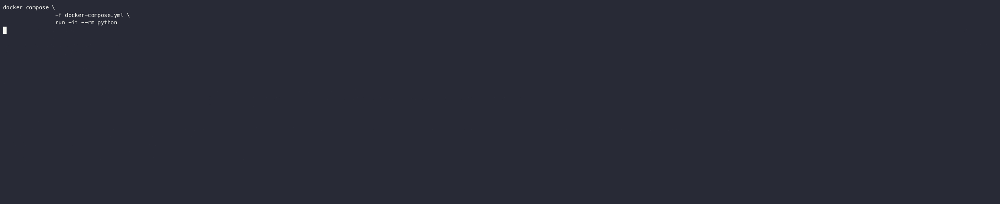

# Fetching Products Examples

Here you will find a collection of CLI commands that take a `link_id`, fetch transactions and store them in a postgres
database with the following table schemas:

```sql
CREATE TABLE links (
    id SERIAL NOT NULL,
    moneykit_id VARCHAR NOT NULL,
    transaction_sync_cursor VARCHAR,
    PRIMARY KEY (id),
    UNIQUE (moneykit_id)
);

CREATE TABLE transactions (
    id SERIAL NOT NULL,
    link_id INTEGER NOT NULL,
    moneykit_id VARCHAR NOT NULL,
    timestamp TIMESTAMP WITHOUT TIME ZONE NOT NULL,
    description VARCHAR,
    pending BOOLEAN NOT NULL,
    PRIMARY KEY (id),
    FOREIGN KEY(link_id) REFERENCES links (id),
    UNIQUE (moneykit_id)
);
```

We have left the `accounts` model out of this example for simplicity. In reality the relationships should be set up as:
- `links`
- `accounts`
    - `link_id`: Foreign key to `links.id`
- `transactions`
    - `account_id`: Foreign key to `accounts.id`




## Getting started

Choose the language for your CLI:
- python: Uses MoneyKit's Python SDK

You must have an already connected `link_id` to be able to use this CLI too. Use our `create_link` example to create one
if you don't already have a `link_id`.

### Set your environment variables

Copy `.env.sample` to `fetching_products/.env`.

Set your `MONEYKIT_CLIENT_ID` and `MONEYKIT_CLIENT_SECRET` in the `.env` file.
We recommend you use your sandbox keys to play around with test institutions.


### Run CLI
0. Start docker and postgres
    ```sh
    make python
    ```
1. Create postgres database tables
    ```sh
    ./cli create-db
    ```
2. Fetch initial transactions
    ```sh
    ./cli apply-diff <link_id>
    ```
3. Print cached transactions from database
    ```sh
    ./cli show <link_id>
    ```
4. Refresh transactions
    ```sh
    ./cli refresh <link_id>
    ```
5. Check refresh state until done
    ```sh
    ./cli state <link_id>
    ```
6. Apply new transaction diff
    ```sh
    ./cli apply-diff <link_id>
    ```
3. Print latest cached transactions from database
    ```sh
    ./cli show <link_id>
    ```
