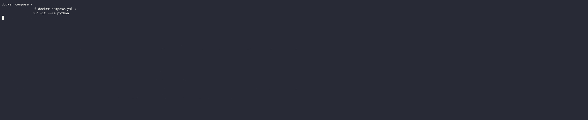

# Fetching Products Examples

Here you will find a collection of CLI commands that take a `link_id`, fetch a product and print the response to your
console.



## Getting started

Choose the language for your CLI:
- python: Uses MoneyKit's Python SDK
- ruby: Uses MoneyKit's Ruby SDK

### Set your environment variables

Copy `.env.sample` to `fetching_products/.env`.

Set your `MONEYKIT_CLIENT_ID` and `MONEYKIT_CLIENT_SECRET` in the `.env` file.
We recommend you use your sandbox keys to play around with test institutions.

### Create a link

You must have an already connected `link_id` to be able to use this CLI too. Use our `create_link` example to create one
if you don't already have a `link_id`.

## Fetch Products

A `Makefile` is set up for convience of running different language targets in Docker.

```sh
make python
```

```sh
make ruby
```

For example, To run the python CLI locally you can:
```sh
cd fetch_products/python
poetry install
./cli --help
./cli get-accounts <link_id>
./cli get-transactions <link_id> --start-date <date> --end-date <date>
```

```sh
cd fetch_products/ruby
bundle install
./cli --help
./cli get-accounts <link_id>
./cli get-transactions <link_id> --start-date <date> --end-date <date>
```

### Show CLI help:
```sh
./cli --help
```

### Get Product Refresh State

```sh
./cli state <link_id>
```

### Request a Product Refresh

```sh
./cli refresh <product> <link_id>
```

### Accounts

```sh
./cli get-accounts <link_id>
```

### Accounts Numbers

```sh
./cli get-account-numbers <link_id>
```

### Identity

```sh
./cli get-identity <link_id>
```

### Transactions

```sh
./cli get-transactions <link_id> --start-date <date> --end-date <date>
```

#### Transactions Sync

```sh
./cli get-transactions-sync <link_id> [--cursor <cursor>]
```

#### Delete

```sh
./cli delete <link_id>
```

https://asciinema.org/
